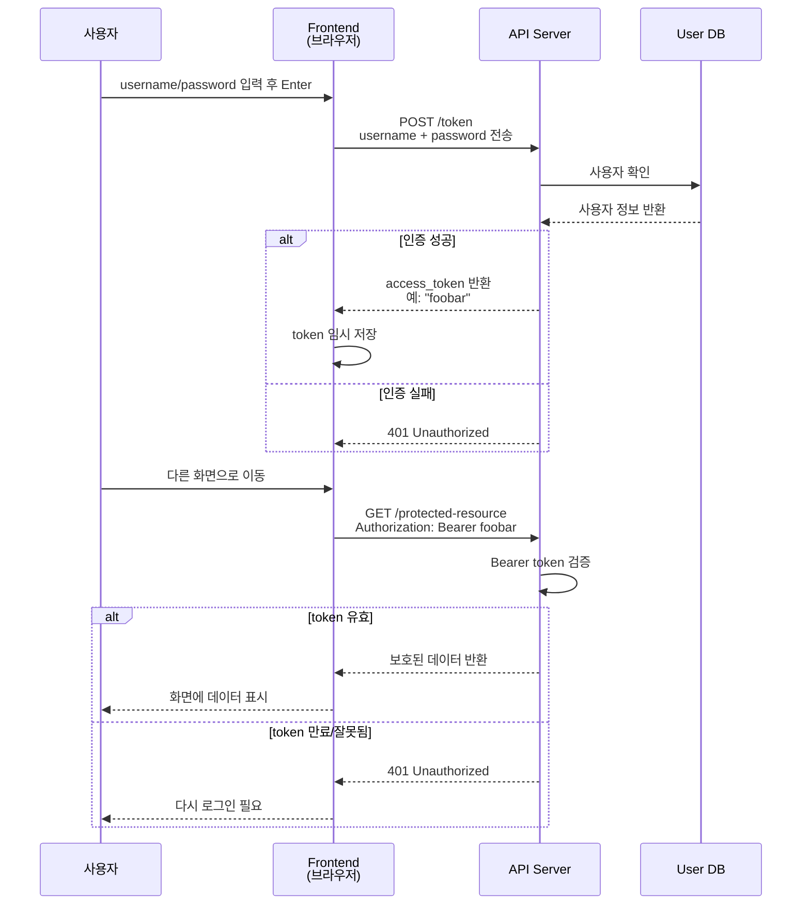

```mermaid
sequenceDiagram
    participant U as 사용자
    participant F as Frontend<br/>(브라우저)
    participant A as API Server
    participant DB as User DB

    U->>F: username/password 입력 후 Enter
    F->>A: POST /token<br/>username + password 전송
    A->>DB: 사용자 확인
    DB-->>A: 사용자 정보 반환

    alt 인증 성공
        A-->>F: access_token 반환<br/>예: "foobar"
        F->>F: token 임시 저장
    else 인증 실패
        A-->>F: 401 Unauthorized
    end

    U->>F: 다른 화면으로 이동
    F->>A: GET /protected-resource<br/>Authorization: Bearer foobar
    A->>A: Bearer token 검증

    alt token 유효
        A-->>F: 보호된 데이터 반환
        F-->>U: 화면에 데이터 표시
    else token 만료/잘못됨
        A-->>F: 401 Unauthorized
        F-->>U: 다시 로그인 필요
    end
```